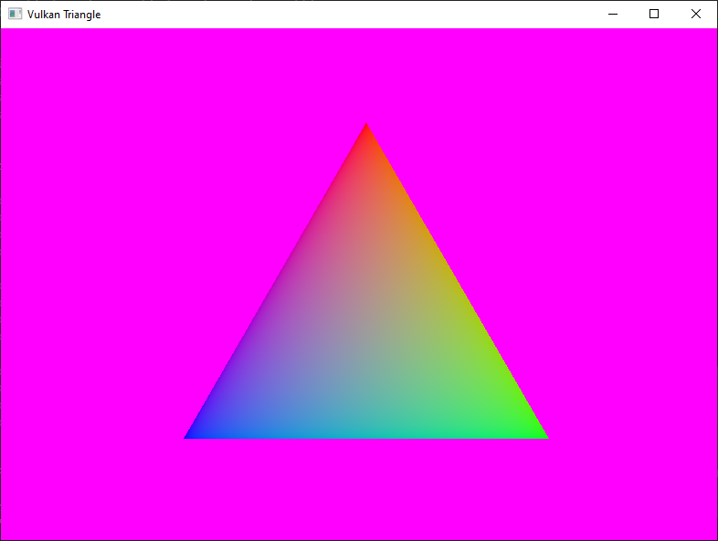

# Vulcan Demo

## A cross-platformSoon™ graphics application utilizing Vulkan

Made this to learn the Vulkan API and related concepts, such as loading libraries.

TODO
- Proper cleanup on close
- Loading `.obj` models
- Loading `.bmp` textures
- Camera
- Scenes
- SPIRV compilation of shaders in program
- Cross-platform code and testing
